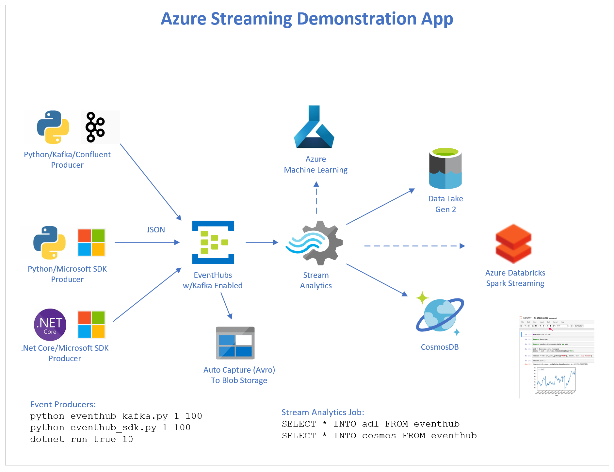

# azure-eventhub-kafka-streaming

Demonstration streaming application using Azure Event Hubs with Kafka API.

## Part 1: Customer Use Cases 

- Augment current batch processing with streaming solution for n-number of sources
- Understand streaming services - Azure EventHubs, Azure EventGrid, Azure ServiceBus, etc
- Understand Azure and Kafka, and Azure EventHubs roadmap re: Kafka-like features
- Understand Azure Stream Analytics
- Use Azure Data LakeGen2 as an event sink
- Explore Azure Databricks with Spark Streaming

---

## Part 2: Azure Event Processing Services

- [See the Azure Documentation](https://docs.microsoft.com/en-us/azure/?product=all)

### Azure PaaS 

- [Azure EventHubs](https://docs.microsoft.com/en-us/azure/event-hubs/event-hubs-about)
  - [Azure EventHubs w/Kafka](https://docs.microsoft.com/en-us/azure/event-hubs/event-hubs-for-kafka-ecosystem-overview)
  - [Azure EventHubs w/Capture](https://docs.microsoft.com/en-us/azure/event-hubs/event-hubs-capture-enable-through-portal)
- [Azure IoT Hub](https://docs.microsoft.com/en-us/azure/iot-hub/about-iot-hub)
- [Azure HDInsight w/Kafka](https://docs.microsoft.com/en-us/azure/hdinsight/kafka/apache-kafka-introduction)
- [Azure Service Bus](https://docs.microsoft.com/en-us/azure/service-bus-messaging/service-bus-messaging-overview)
- [Azure Event Grid](https://docs.microsoft.com/en-us/azure/event-grid/overview)
- [Azure Stream Analytics](https://docs.microsoft.com/en-us/azure/stream-analytics/stream-analytics-introduction)
- [Azure Databricks with Spark Streaming](https://docs.microsoft.com/en-us/azure/azure-databricks/databricks-stream-from-eventhubs)
- [Azure Synapse with Spark Streaming](https://docs.microsoft.com/en-us/azure/synapse-analytics/sql-data-warehouse/sql-data-warehouse-overview-what-is)
- [Azure Functions](https://docs.microsoft.com/en-us/azure/azure-functions/functions-overview)
- [Azure CosmosDB](https://docs.microsoft.com/en-us/azure/cosmos-db/introduction)

### 

- Marketplace Offerings - ActiveMQ, RabbitMQ, etc 

---

## Part 3: Demonstration

Demo app consists of:
1) Python Kafka Producer
2) Azure EventHub with Kafka Enabled
3) Azure Blob Storage for EventHub message Capture
4) Azure Stream Analytics to Consume to EventHub
5) Azure CosmosDB - Sink for Azure Stream Analytics
6) Azure Datalake Gen2 - Sink for Azure Stream Analytics
7) (TODO) Azure Databricks - Alternative EventHub stream consumer

<p align="center">
  
</p>

---

### Alternative EventHub Pipeline

EventHubs and Azure Functions can be **pipelined** for functionality similar to **Kafka Streams** Java code.

<p align="center">
  
</p>

### Provisioning the Azure Resources for this Demonstration

See the bash/az scripts in the **automation/az/** directory.
Edit file **env.sh** per your preferred Azure region, resource group, resource names,
and other service configuration.

Execute each of these scripts in turn:

```
$cd automation/az

./extensions.sh           <-- installs extensions to the az cli program

./adl.sh                  <-- provisions datalake gen 2
./storage.sh              <-- provisions blob storage
./eventhubs.sh            <-- provisions eventhubs with kafka api enabled, with dev hub
./cosmos_sql.sh           <-- provisions cosmosdb with sql api and events collection
./stream_analytics.sh     <-- provisions an empty stream analytics account (no code)
```

#### Provisioning an Azure EventHubs account to enable Kafka

Script **eventhubs.sh** specifies **--enable-kafka** to be true.

```
    az eventhubs namespace create \
        --name $eventhubs_namespace \
        --resource-group $eventhubs_rg \
        --subscription $subscription \
        --location $eventhubs_region \
        --sku $eventhubs_sku \
        --enable-kafka $eventhubs_enable_kafka \
        --enable-auto-inflate $eventhubs_enable_auto_inflate \
        --maximum-throughput-units $eventhubs_max_tu \
        > out/eventhubs_namespace_create.json
```

#### CosmosDB Time-to-Live

TTL can optionally be set in CosmosDB, for example:

```
    --ttl 86400   (optional, in seconds, 60 * 60 * 24 = 86400, or 24 hours)
```

### Configure EventHub Message Capture

Azure EventHub messages can optionally and automatically be captured to Azure Blob storage, 
Azure Data Lake Storage Gen1, or Azure Data Lake Storage Gen2.
See https://docs.microsoft.com/en-us/azure/event-hubs/event-hubs-capture-enable-through-portal

The output data format is **avro**.

This can be configured in Azure Portal in your EventHub account as shown here:

<p align="center">
  
</p>

### Create the Azure Stream Analytics Job

Easily consume the EventHub stream of data, and save it to both CosmosDB and Data Lake
with only two lines of code.  Simply define the input (eventhub) and the outputs (adl, cosmos).

Define the **Job** in a SQL-like syntax:

```
SELECT * INTO adl FROM eventhub
SELECT * INTO cosmos FROM eventhub
```
<p align="center">
  
</p>

---

### Client Computer Setup

#### Environment Variables

Set the following three environment variables per your EventHub keys in Azure Portal.
Example values are shown.
```
AZURE_STREAMPOC_EVENTHUB_CONN_STRING="Endpoint=sb://cjoakimstreameh.servicebus.windows.net/;SharedAccessKeyName=RootManageSharedAccessKey;SharedAccessKey=<secret>"
AZURE_STREAMPOC_EVENTHUB_NAMESPACE=cjoakimstreameh
AZURE_STREAMPOC_EVENTHUB_HUBNAME=dev
```

#### Create Python Virtual Environment

```
$ cd py
$ ./venv.sh create
$ source bin/activate
```

#### Send messages to EventHub using the Kafka Producer API

Event Hubs supports Apache Kafka protocol 1.0 and later, and works with your existing Kafka applications, including MirrorMaker.

The following sends 100 messages in a randomized sequence, with Python and the **confluent-kafka**
library.

```
$ python eventhub.py 1 100

sending message: {"location": {"type": "Point", "coordinates": [-78.6388, 35.7719]}, "postal_cd": "27621", "country_cd": "US", "city_name": "Raleigh", "state_abbrv": "NC", "latitude": 35.7719, "longitude": -78.6388, "pk": "27621", "seq": 1, "timestamp": "2020-06-15 20:09:41", "epoch": 1592251781}
Message delivered to; topic: dev, partition: 0, offset: 1368

...
```

See file **py/data/nc_zipcodes.json** in this repo which contains the demonstration dataset - 
North Carolina postal codes.  These raw messages are augmented by the Python Kafka Producer program
to add pk, seq, timestamp, and epoch attributes.

```
  {
    "location": {
      "type": "Point",
      "coordinates": [
        -80.8433,
        35.5095
      ]
    },
    "postal_cd": "28035",
    "country_cd": "US",
    "city_name": "Davidson",
    "state_abbrv": "NC",
    "latitude": 35.5095,
    "longitude": -80.8433
  },
```

### Query the Messages in CosmosDB

```
select * from c where c.city_name = "Raleigh" and c.epoch >= 1592251781
```

<p align="center">
  
</p>


### Display the Messages and Schema in an EventHub Avro file

Download an avro file from Azure Blob Storage (i.e. - data/54.avro).
See **avro.py** in the py/ directory.

```
$ python avro.py data/54.avro

Displaying the messages in Avro file: data/54.avro

{'SequenceNumber': 66, 'Offset': '14280', 'EnqueuedTimeUtc': '6/12/2020 6:32:34 PM', 'SystemProperties': {}, 'Properties': {}, 'Body': b'{"location": {"type": "Point", "coordinates": [-77.5171, 35.5857]}, "postal_cd": "27811", "country_cd": "US", "city_name": "Bellarthur", "state_abbrv": "NC", "latitude": 35.5857, "longitude": -77.5171, "seq": 1, "timestamp": "2020-06-12 18:32:34", "epoch": 1591986754}'}

{'SequenceNumber': 67, 'Offset': '14680', 'EnqueuedTimeUtc': '6/12/2020 6:32:35 PM', 'SystemProperties': {}, 'Properties': {}, 'Body': b'{"location": {"type": "Point", "coordinates": [-80.8434, 35.2267]}, "postal_cd": "28222", "country_cd": "US", "city_name": "Charlotte", "state_abbrv": "NC", "latitude": 35.2267, "longitude": -80.8434, "seq": 1, "timestamp": "2020-06-12 18:32:35", "epoch": 1591986755}'}

{'SequenceNumber': 68, 'Offset': '15080', 'EnqueuedTimeUtc': '6/12/2020 6:32:36 PM', 'SystemProperties': {}, 'Properties': {}, 'Body': b'{"location": {"type": "Point", "coordinates": [-81.108086, 35.455008]}, "postal_cd": "28080", "country_cd": "US", "city_name": "Iron Station", "state_abbrv": "NC", "latitude": 35.455008, "longitude": -81.108086, "seq": 1, "timestamp": "2020-06-12 18:32:36", "epoch": 1591986756}'}
```

```
Displaying the schema within the Avro file
{
  "fields": [
    {
      "name": "SequenceNumber",
      "type": "long"
    },
    {
      "name": "Offset",
      "type": "string"
    },
    {
      "name": "EnqueuedTimeUtc",
      "type": "string"
    },
    {
      "name": "SystemProperties",
      "type": {
        "type": "map",
        "values": [
          "long",
          "double",
          "string",
          "bytes"
        ]
      }
    },
    {
      "name": "Properties",
      "type": {
        "type": "map",
        "values": [
          "long",
          "double",
          "string",
          "bytes",
          "null"
        ]
      }
    },
    {
      "name": "Body",
      "type": [
        "null",
        "bytes"
      ]
    }
  ],
  "name": "EventData",
  "namespace": "Microsoft.ServiceBus.Messaging",
  "type": "record"
}
```

### Consume the Event Hub Stream with Azure Databricks

https://docs.microsoft.com/en-us/azure/azure-databricks/databricks-stream-from-eventhubs

